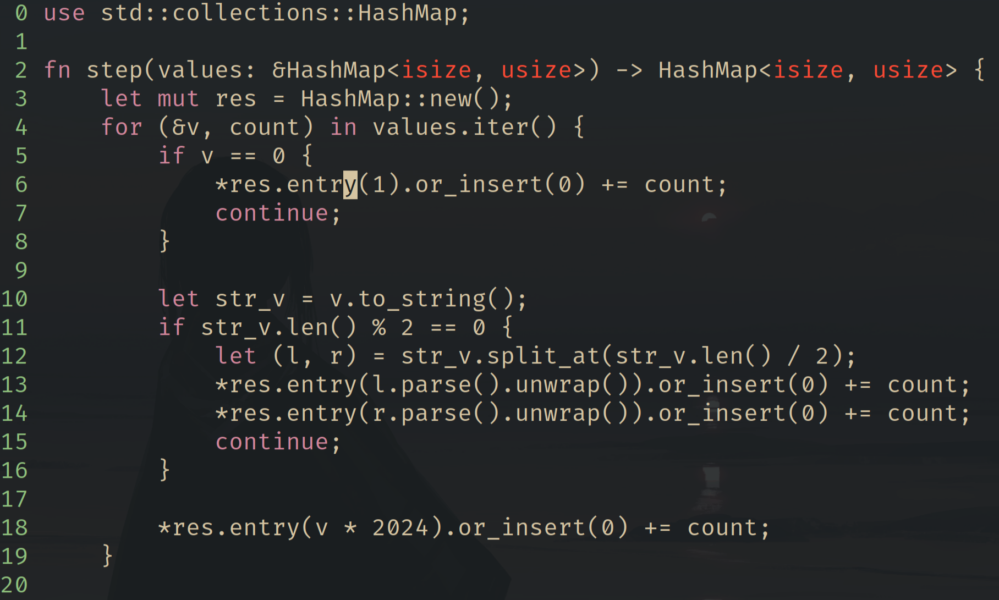

# Edi - A vim-like text editor in Rust

Edi is a lightweight, text editor inspired by Vim, written in Rust. It's currently in very early development. The goal is to create a fast, minimal code editor that I myself would use. Syntax highlighting, formatting and lsp support should come out of the box.



## Features

- normal, insert and terminal mode support
- basic movement keymaps
- file saving
- basic keyword highlighting

## Keymaps

Some of the supported keymaps are:

- h,j,k,l - move the cursor
- G - move cursor to the end of the file
- 0,$,^ - move cursor to line start/end/first non-whitespace char
- e - move cursor to the end of the word
- Ctrl+u,Ctrl+d - move the cursor half of the screen up/down
- i - enter insert mode
- esc - return to normal mode
- :wq - save file and quit
- :q - quit

## Installation

Currently the only way to install `edi` is to build it from source:

```sh
git clone https://github.com/mikeyQwn/edi
cd edi
cargo install --path ./edi
```

To run edi, simply type

```sh
edi [filename]
```

## Roadmap

Features:

- [ ] Persistent undo/redo
- [ ] Visual mode, text selection
- [ ] Empty buffer mode
- [ ] Input buffering
- [ ] Search/replace
- [ ] Config file
- [ ] Yank and paste, buffers
- [ ] Multiple buffers, open multiple files
- [ ] Treesitter integration
- [ ] LSP integration
- [ ] Scripting language support

Tech debt:

- [ ] Optimize the rope data structure
- [ ] Handle terminal resizing properly
- [ ] Ci tests, add test badge to the README
